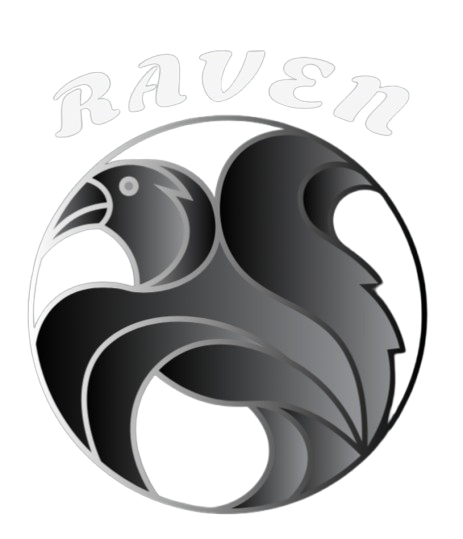

<h1 align="center">Raven - Mail Delivery Agent</h1>

<p align="center">
  
</p>

**_A lightweight Mail Delivery Agent written in Go, providing IMAP, LMTP, and SASL support with SQLite-based storage._**

[](https://www.apache.org/licenses/LICENSE-2.0)


<p align="center">
  •   <a href="#why-raven">Why Raven?</a> •
  <a href="#architecture">Architecture</a> •
  <a href="#getting-started">Getting Started</a> •
  <a href="#contributing">Contributing</a> •
  <a href="#license">License</a> •
</p>

## Why Raven?

Raven was built to overcome the limitations of traditional Mail Delivery Agents with outdated and complex architectures. 
Instead of relying on legacy file-based storage, Raven adopts a per-user SQLite database model and separates attachments 
into a dedicated storage system. This design significantly improves performance, scalability, backup reliability, and 
long-term maintainability—making Raven a modern, efficient solution for email delivery and management. With more modern 
email features on the way, stay tuned for updates!!!

### Key Features
- **Modern Architecture:** Per-user SQLite databases for efficient data isolation
- **S3 Blob Storage:** Store email attachments in S3-compatible storage (SeaweedFS)
- **Identity Provider Integration:** Separate user management (Eg: [Thunder](https://github.com/asgardeo/thunder))
- **High Performance:** Deduplication, efficient indexing, and scalable storage
- **Easy Deployment:** Simple configuration, containerized deployment
- **Full IMAP Support:** Complete IMAP4rev2 implementation with extensions
- **Secure:** TLS/SSL support, external authentication integration

## Architecture

Raven consists of three services:

### IMAP Server (Ports 143, 993)
- Email client access to mailboxes
- Standard IMAP commands: SELECT, FETCH, SEARCH, STORE, COPY, APPEND, EXPUNGE
- Mailbox operations: CREATE, DELETE, RENAME, LIST, SUBSCRIBE
- TLS/SSL support (STARTTLS and IMAPS)

### LMTP Delivery Service (Port 24)
- Receives incoming mail from MTAs (e.g., Postfix)
- Parses and stores messages in SQLite database
- Routes messages to user mailboxes

### SASL Authentication Service (Unix socket)
- Handles authentication via external auth server
- Integrates with MTAs for SMTP authentication

All services use a **multi-database SQLite architecture** for efficient data isolation and scalability.

## Getting Started

### Option 1: Pull from GitHub Container Registry (Recommended)

```bash
docker pull ghcr.io/lsflk/raven:latest
docker run -d --rm \
  --name raven \
  -p 143:143 -p 993:993 -p 24:24 \
  -v $(pwd)/config:/etc/raven \
  -v $(pwd)/data:/app/data \
  -v $(pwd)/certs:/certs \
  ghcr.io/lsflk/raven:latest
```

### Option 2: Build from Source

1. Clone the repository:
```bash
git clone https://github.com/LSFLK/raven.git
cd raven
```

2. Build and run:
```bash
docker build -t raven .
docker run -d --rm \
  --name raven \
  -p 143:143 -p 993:993 -p 24:24 -p 12345:12345 \
  -v $(pwd)/config:/etc/raven \
  -v $(pwd)/data:/app/data \
  -v $(pwd)/certs:/certs \
  raven
```

The server will start and listen on:
- **Port 143** - IMAP
- **Port 993** - IMAPS
- **Port 24**  - LMTP
- **Port 12345** - SASL (TCP)

Connect using any IMAP client to start managing your emails.

---

### 📂 Required Volume Mounts

| Volume                      | Path                                  | Description                                                                                        |
|-----------------------------|---------------------------------------|----------------------------------------------------------------------------------------------------|
| **Configuration(IMAP)**     | `-v $(pwd)/config:/etc/raven`         | Configuration directory containing `raven.yaml`                                                    |
| **Data**                    | `-v $(pwd)/data:/app/data`            | Data directory for SQLite databases (`shared.db`, `user_db_*.db`, `role_db_*.db`) and mail storage |
| **Certificates**            | `-v $(pwd)/certs:/certs`              | TLS/SSL certificates directory containing `fullchain.pem` and `privkey.pem` for IMAPS and STARTTLS |
| **Configuration(Delivery)** | `-v $(pwd)/config:/etc/raven` | Delivery service configuration file `delivery.yaml`                                                 |

---

### 🔐 Certificate Requirements

Your `/certs` directory must contain:
- `fullchain.pem` - Full certificate chain
- `privkey.pem` - Private key

These certificates are required for secure connections on port 993 and STARTTLS functionality.

### ⚙️ IMAP Configuration File (`raven.yaml`)

Raven requires a configuration file named `raven.yaml` located in `/etc/raven` inside the Docker container for IMAP server. 
You can see an [example raven.yaml](../config/raven.yaml) for your reference. Update the `raven.yaml` file according to your config.


### Delivery Service Configuration File (`delivery.yaml`)

The delivery service requires a separate configuration file named `delivery.yaml` and should reside inside the `/etc/raven` folder of the Docker container.
You can see the [example delivery.yaml](../config/delivery.yaml) for reference. Update the `delivery.yaml` file according to your config.

## Contributing

Thank you for wanting to contribute to our project. Please see [CONTRIBUTING.md](https://github.com/LSFLK/raven/blob/main/docs/CONTRIBUTING.md) for more details.

## License

Distributed under the Apache 2.0 License. See [LICENSE](https://github.com/LSFLK/raven/blob/main/LICENSE) for more information.

